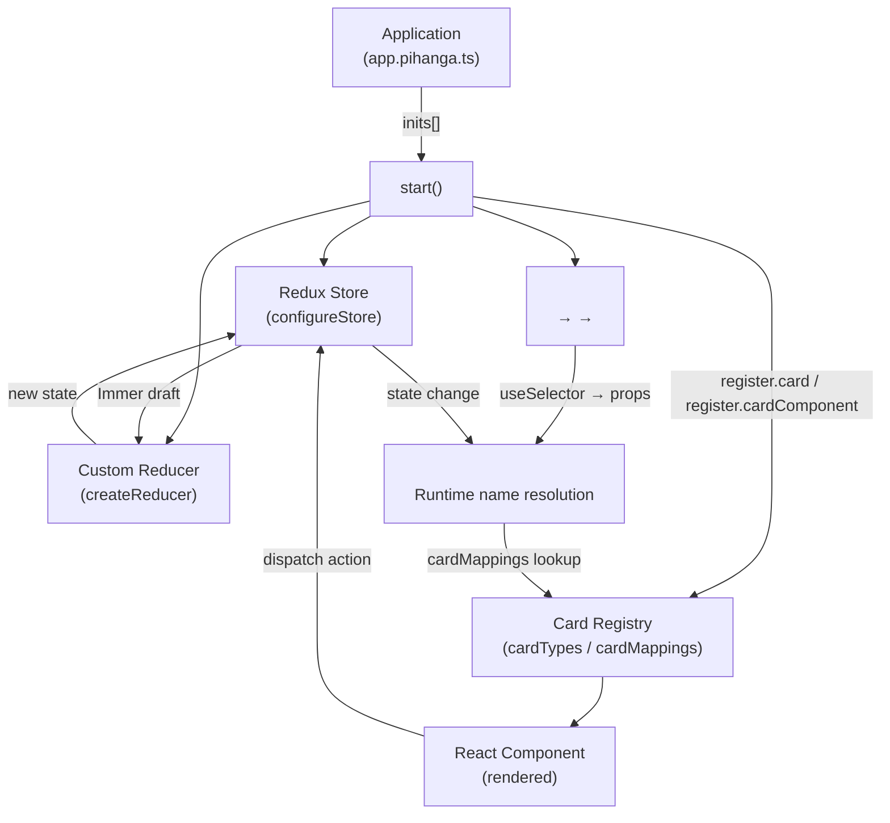
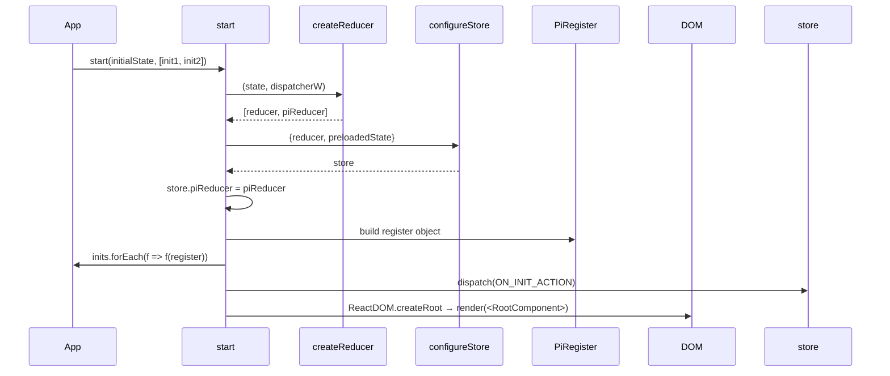
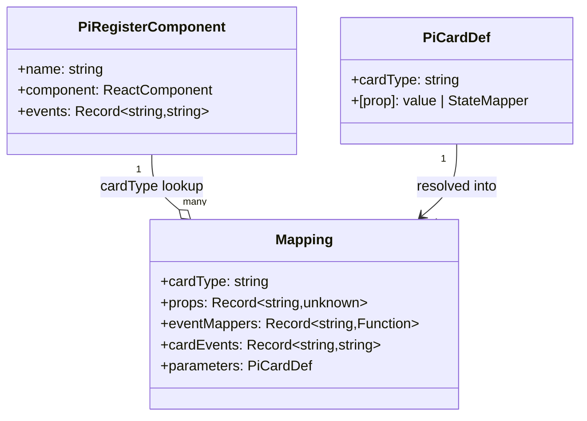
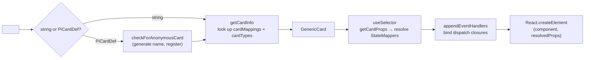
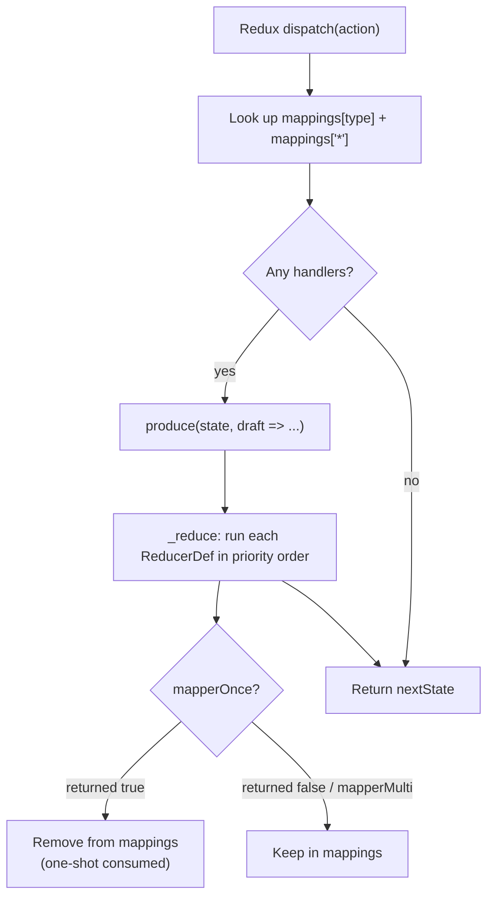
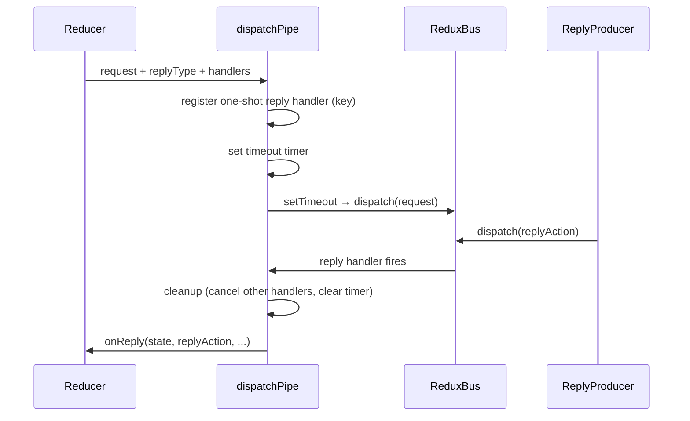
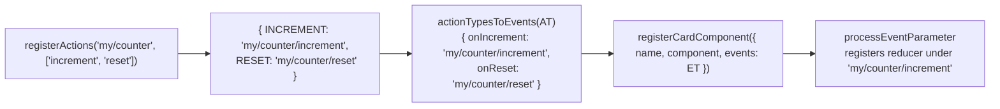

# Pihanga Core — Design Document

This document describes the internal architecture of `@pihanga2/core`, with a focus on the
**card registry** and the **Redux/reducer pipeline**. It is intended for library contributors
and developers who want a deep understanding of how the runtime works.

---

## 1. High-Level Architecture

Pihanga is a declarative, card-based UI framework layered on top of React and Redux Toolkit.
The central idea is **late binding**: a parent component never hard-codes its children. Instead
it holds a *named slot*, and the actual component that fills that slot is looked up in a global
registry at render time. Changing one field in the Redux store can therefore swap out an entire
sub-tree of the UI with no component-level code changes.



---

## 2. Bootstrap Sequence (`start`)

`start(initialState, inits, props)` in `src/index.ts` is the sole entry point. It:

1. Merges `DEFAULT_REDUX_STATE` with the caller-supplied initial state and seeds the route from
   the browser URL via `currentRoute()`.
2. Calls `createReducer(state, dispatcherW)` to produce a `[reducer, piReducer]` pair. The
   `dispatcherW` wrapper is a forward reference; it is wired to `store.dispatch` after the Redux
   store is created.
3. Calls `configureStore({ reducer, preloadedState })` (Redux Toolkit). The `piReducer` handle
   is stored on the store object (`store.piReducer`) so card components can reach it via
   `useStore()`.
4. Builds a `PiRegister` object — the single surface through which all registration happens
   (cards, card components, meta-cards, reducers, REST helpers).
5. Calls each `init` function in `inits[]` with the `PiRegister`, then flushes the
   `pendingRegistrations` buffer (callbacks that were queued before `start()` ran via the
   top-level `register()` helper).
6. Dispatches `ON_INIT_ACTION` so the router and any one-shot initialisation reducers fire.
7. Renders `<RootComponent>` — a React `<Provider>` wrapping a single `<Card cardName="_window">`.



---

## 3. Cards

### 3.1 Two-Level Registry

The card system maintains two distinct lookup tables, both plain module-level objects in
`src/register_cards.ts`:

| Table | Key | Value | Purpose |
|---|---|---|---|
| `cardTypes` | Card type string (e.g. `"my/counter"`) | `PiRegisterComponent` | Maps a type name to its React component + event map |
| `cardMappings` | Card instance name (e.g. `"page/counter"`) | `Mapping` | Maps a named instance to its resolved props, event handlers, and the card type it uses |



### 3.2 Registering a Card Component (Type)

`registerCardComponent({ name, component, events })` calls `addCardComponent()` which stores
the entry in `cardTypes`. This can safely be called at module load time because it is buffered
until `start()` runs via the `register()` helper.

The `events` map is produced by `actionTypesToEvents(registerActions(...))`:
- `registerActions("my/counter", ["increment", "reset"])` → `{ INCREMENT: "my/counter/increment", RESET: "my/counter/reset" }`
- `actionTypesToEvents(...)` → `{ onIncrement: "my/counter/increment", onReset: "my/counter/reset" }`

This two-step translation produces the `onXxx` prop names that appear on `PiCardProps<P, E>`.

### 3.3 Registering a Card Instance

`register.card("page/counter", CounterCard({ count: 0, ... }))` calls `_registerCard`, which
calls `_createCardMapping`. This function iterates over every key in the `PiCardDef` parameters:

- **`cardType`** — skipped; used only for the type lookup.
- **Nested `PiCardDef` objects** — recursively registered as child cards under
  `"parentName/propKey"` (enabling anonymous inline card definitions).
- **`on…` event handler functions** — passed to `processEventParameter`, which calls
  `registerReducer(actionType, wrappedHandler, ...)`. The wrapper checks `action.cardID === cardName`
  so each card's handler fires only for its own events.
- **`on…Mapper` functions** — stored in `eventMappers` for client-side action transformation
  before dispatch.
- **Everything else** — stored verbatim in `props` (either a static value or a `StateMapper`
  function).

### 3.4 The `<Card>` Component and Rendering Pipeline

`<Card cardName="page/counter" parentCard="page" />` is the universal renderer in `src/card.tsx`.



**`getCardProps`** (called inside `useSelector`) iterates over the `Mapping.props` entries. For
each value:
- If it is a `StateMapper` function `(state, context) => T`, it is called with the current Redux
  state.
- If it is a static value but the parent also passed the same key as a context prop, the context
  prop wins (allowing parent-override of defaults).

The result is memoised by React/Redux through `useSelector`'s equality check (`propEq` using
`deep-equal`). A re-render is triggered only when the resolved props actually change.

**`appendEventHandlers`** wires the `events` map from the card type definition. For each
`onXxx` → `actionType` pair, it creates a closure that sets `action.type = actionType` and
`action.cardID = cardName` before dispatching — providing the `cardID` that the reducer wrapper
checks to scope the handler to the right card instance.

### 3.5 Anonymous / Inline Cards

When a `PiCardDef` object (not a string) is passed as `cardName`, `checkForAnonymousCard`
synthesises a stable name from `"parentCard/cardType#randomId"` and calls `_registerCard` or
`_updateCardMapping` as needed. This allows card declarations to be written inline inside a
parent card's `content` prop without requiring a separate named registration call.

### 3.6 State Mappers and `memo`

Any prop value in a `PiCardDef` can be a `StateMapper<T, S>`:

```ts
type StateMapper<T, S extends ReduxState, C = PiDefCtxtProps> =
  (state: S, context: StateMapperContext<C>) => T;
```

Because state mappers are called on every `useSelector` invocation, allocating a new object or
array every time causes unnecessary re-renders. `memo(filterF, mapperF)` in
`src/register_cards.ts` solves this:

1. It closes over `lastFilter` and `lastValue` maps (keyed by `context.cardKey`).
2. On each call it runs `filterF(state)` and compares the result with the previous call using
   `deep-equal`.
3. Only if the filtered slice has changed does it invoke `mapperF` to compute the new value.

### 3.7 Meta-Cards

A **meta-card** is a higher-order card type that *expands* a single `PiCardDef` into a tree of
registered child cards. It is registered with `register.metaCard({ type, mapper, events })`.
When `_registerCard` encounters an unknown card type, it checks `metacardTypes` before giving up.
The `mapper(metaName, parameters, registerCard)` function receives a `registerCard` helper that
automatically namespaces child names under `metaName/…` and delegates back to `_registerCard`.
This allows complex compound widgets to be expressed as a single declarative call site.

---

## 4. Redux and Reducers

### 4.1 `createReducer`

`createReducer(initialState, dispatcher)` in `src/reducer.ts` returns a standard Redux
`[reducer, piReducer]` pair.

Internally it maintains a `mappings` object:

```ts
const mappings: { [actionType: string]: ReducerDef[] } = {}
```

Each `ReducerDef` holds:
- `mapperMulti` — a persistent reducer (stays registered until explicitly cancelled)
- `mapperOnce` — a one-shot reducer (automatically removed after its first successful run)
- `priority` — execution order within the same action type
- `key` — a stable string identifier used for deduplication and cancellation
- `targetMapper` — original user handler (used by the card-scoping wrapper to identify replacements)

### 4.2 The Redux Reducer Function

The inner `reducer(state, action)` function runs on every Redux dispatch. It:

1. Looks up `mappings[action.type]` and `mappings["*"]` (wildcard).
2. If there are no registered handlers, returns the state unchanged — except that it clears
   `state.pihanga.reducers` if it is non-empty (housekeeping).
3. Wraps state mutation in an **Immer** `produce()` call, so handlers can either mutate the
   draft or return a new object.
4. Calls `_reduce()` for each handler list. `_reduce` runs each `ReducerDef` in order,
   automatically removing one-shot reducers when their `mapperOnce` returns `true`.
5. Writes the list of executed reducer keys to `state.pihanga.reducers` for debugging.



### 4.3 Reducer Registration and Priorities

`piReducer.register(eventType, mapper, priority, key)` calls `addReducer`, which:

1. Removes any existing entry with the same `key` (idempotent re-registration).
2. Pushes the new `ReducerDef` and sorts the array by descending priority.
3. Captures the call-site stack frame via `stacktrace-js` to populate `key` automatically when
   none is provided (aids debugging).
4. Returns a cancel function `() => removeReducer(key, mappings[eventType])`.

Default priority is `0`. Higher numbers run first. This allows card event handlers (registered
at priority `0`) to be overridden by framework-level handlers at higher priorities.

### 4.4 Inline Event-Handler Scoping

When `processEventParameter` registers a reducer for an `onXxx` prop, it wraps the user handler:

```ts
registerReducer(actionType, (state, action, dispatch, opts) => {
  if ((action as CardAction).cardID === cardName) {
    userHandler(state, action, dispatch, opts);
  }
}, 0, `on card ${cardName} for ${propName}`, userHandler);
```

The `cardID === cardName` check ensures that two card instances of the same type each respond
only to their own events, even though both are registered under the same Redux action type.

### 4.5 `dispatchPipe` — Async Request/Reply

`dispatchPipe` (available as `opts.dispatchPipe` inside any reducer) implements a correlated
request/reply pattern without sagas or thunks:



Key properties:
- The request is dispatched asynchronously (`setTimeout 0`) so the current reducer tick
  completes before the outgoing action is processed.
- Both the reply and error handlers are registered with explicit `key` strings so they can be
  cancelled when the pipe settles or times out.
- If `timeoutMs` elapses, a synthetic `pi/dispatchPipe/timeout` action is dispatched, which
  triggers the `onTimeout` handler and cleans up all remaining handlers.

### 4.6 `RegisterCardState` — Debug Slice

`RegisterCardState` in `src/card.tsx` is an internal subsystem that mirrors card props into
`state.pihanga.cards` for Redux DevTools inspection. It works on a 1-second debounce timer:
whenever any card's props change (detected in `propEq`), a `pi/card/update_state` action is
dispatched. The built-in `UPDATE_STATE_ACTION` reducer (always present in `mappings`) writes
serialisable snapshots of all card props into the Redux state tree.

---

## 5. Action Namespacing



`registerActions` prevents namespace collisions by warning on overwrite and stores a
`ns2Actions` guard. The `UPPER_CASE` → `onCamelCase` transformation in `actionTypesToEvents`
is purely cosmetic — it exists so the event names on `PiCardProps<P, E>` follow React
conventions (`onClick`, `onChange`, …).

---

## 6. Key Design Decisions

| Decision | Rationale |
|---|---|
| **Late binding via name strings** | Decouples layout declaration from component implementation. Pages can be re-wired by changing a single state field. |
| **Immer inside the reducer** | Allows both mutation syntax and return-new-object syntax in handlers, matching Redux Toolkit conventions. |
| **`cardID` scoping on actions** | Multiple instances of the same card type can coexist without needing separate action types. |
| **Registration buffering (`pendingRegistrations`)** | Card library modules can safely call `registerCardComponent()` at import time, before `start()` runs. |
| **Priority-ordered reducers** | Framework-level concerns (auth, routing) can pre-empt or post-process card-level handlers without modifying card code. |
| **`dispatchPipe` instead of thunks/sagas** | Keeps async coordination inside pure reducer functions, without introducing middleware or generators. |
| **`memo` as a first-class primitive** | Prevents unnecessary re-renders caused by derived values (new arrays/objects) being recomputed on every selector call. |
| **`state.pihanga.cards` debug slice** | Makes the current resolved props of every visible card inspectable in Redux DevTools without any additional instrumentation. |
