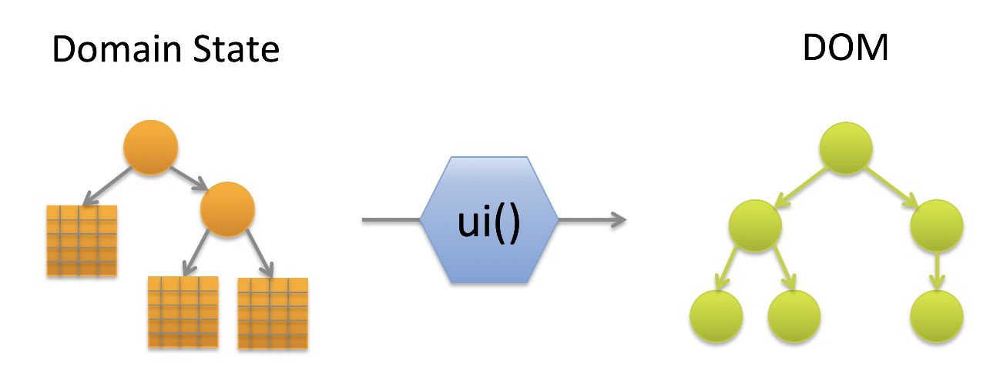

# Pihanga - Framework for dynamically extendible React apps

> [pihanga](https://s3.amazonaws.com/media.tewhanake.maori.nz/dictionary/38608.mp3)
> (noun) window, sliding slab of the traditional window of a wharenui.

## Motivation

Most of the web frontends we are usually building are for a rather small user base to better use or maintain rather complex backends. Many of those systems start out small but over time expand in various directions by different teams using different technologies. Most likely a common scenario for many business support services.

We use micro services and similar technologies to avoid any unnecessary dependencies in the backend, but our users, understandably want a unified UX on the frontend.

This project is an attempt to achieve that while supporting the independent development of the various parts and components surfacing specific backend capabilites. In other words, we want to minimize the amount of code changes when adding new functionality while still supporting an integrated UX experience.

Let me explain that with a trivial example. Let us assume we just delivered an internal car booking service for a company. After a successful launch a different part of the business in charge of managing the truck fleet wants to add their service to it, as well. Their backend is very different and the original frontend team has already been dissolved. We want to make it easy for the "truck" team to independently develop the truck specific UX components as well as extension points to existing generic functionality, such as search, without needing to modify the car components. Frontend integration should be as simple as adding an additional script link to the index page.

## Approach

We have found the React/Redux approach to be extremely useful in managing dependencies between UX components and cleanly separating state synchronisation between front- and backend. In addition, a purely functional approach to component design not only leads to much cleaner code, but also simplifies testing considerably. We can visualize this as:



With the positive lessons learned from defining a web page as pure functions over a single state structure, we wanted to see if we can push this further and essentially derive the above function _ui()_ itself as the result of another function over the _UX_ state object.

In order to do that, we need to define a _construction_ model for a web page. In _Pihanga_, like in other frameworks, a page is composed of hierarchically nested **cards**. Or, in other words, a _tree of cards_ with the root of the tree being the entire page frame. Each card can contain normal web components as well as other cards. Current practice will not only select the card
to be embedded in another card, but also declare all it's properties. For instance:

```
export const FooCard = (props) ==> {
  ...
  return {
    <>
      ...
      <BooCard p1={...} p2={...} ... />
      ...
    </>
  }
}
```

And that's where _Pihanga_ departs from current practice. Instead of a declaring the exact card to embed, we employ a _late binding_ approach, where the embedded card is only identified by a locally unique identifier. The same code
segment as above in _Pihanga_ looks like:

```
export const FooCard = (props) ==> {
  ...
  return {
    <>
      ...
      <Card cardName="Boo" />
      ...
    </>
  }
}
```

where `Card` is essentially a placeholder for a _Pihanga component_ defined separately.

The _Pihanga_ state structure, different to the _Redux state tree_, is a map between the `cardName` of a card and it's associated property list. In addition, the values in that property list can be queries (currently functions) over the entire _Pihanga_ state (all other cards) as well as the _Redux_ state.

Let's demonstrate that on a simple app consisting of a frame-filling `page` card which will show one of two listing cards depending on the `showList` property in the Redux state which is expected to either contain `cars` or `trucks`.

The _Pihanga_ state structure is defined as follows:

```javascript
export default {
  page: AppPage({
    title: 'Transportation Service',
    subTitle: (_, ref) => ref('.', 'contentCard', 'title'),
    contentCard: (state) => state.showList,
    //...
  }),
  cars: Table({
    title: 'Cars',
    //...
  }),
  trucks: Table({
    title: 'Trucks',
    //...
  }),
}
```

and the `AppPage` card is implemented as follows:

```javascript
import { Card } from '@pihanga/core';

export const AppPageCard = ({
  title,
  subTitle,
  contentCard,
  //...
}) => {
  return (
    <div>
      ...
      <Card cardName={contentCard} />
      ...
    </div>
  );
};
```

In this simple example the mapping between `<Card cardName={contentCard} />` and the actual card embedded is determined by the
value bound to the `contentCard` property of of the _Pihanga state_ of the card (`page`) embedding it. That value can either be a
constant (`title: 'Cars'`), a reference to the property value of another card (`... => ref('.', 'contentCard', 'title')`), or a function on the current _Redux_ state (`... => state.showList`).

Simply changing the value of `showList` to a different value, will not only change what card is being embedded inside `AppPageCard`, but also the `subTitle` that card is displaying. Beside the dynamic nature of this approach, we can now also
develop 'template' cards which can dynamically be adapted to various different uses **without** having to change their internals.

---

# @pihanga2/core

The **core runtime library** for the [Pihanga](https://github.com/ivcap-works/pihanga) declarative, card-based UI framework for React.

Pihanga lets you build UIs by _registering_ self-contained **cards** — independently typed UI units with props, events, and Redux-backed state management — rather than composing a monolithic component tree. `@pihanga2/core` provides the registration engine, Redux store bootstrap, routing, and a typed REST-API helper.

## Stack

- **Language**: [TypeScript](https://www.typescriptlang.org/) ^5.0
- **UI Runtime**: [React](https://react.dev/) ^18 (peer)
- **State**: [Redux Toolkit](https://redux-toolkit.js.org/) ^2
- **Routing**: [history](https://github.com/remix-run/history) ^5
- **Logging**: [tslog](https://tslog.js.org/) ^4
- **Build**: `tsc` + [TypeDoc](https://typedoc.org/)
- **Testing**: [Vitest](https://vitest.dev/) + [Testing Library](https://testing-library.com/)
- **Linting**: [ESLint](https://eslint.org/) v9 (flat config) + typescript-eslint

## Quick Start

```bash
# Install dependencies
yarn install

# Build (compile + generate docs)
make build

# Run all checks: lint + type-check + tests (CI)
make check

# Run tests in watch mode
make test

# Publish to npm (builds first)
make publish
```

## Installation (as a library consumer)

```bash
yarn add @pihanga2/core react react-dom react-redux
```

## Core API

### `start(initialState, inits?, props?)`

Bootstrap the Pihanga framework. Creates the Redux store, sets up routing, mounts the React root, and runs all registered initialisation callbacks.

```ts
import { start } from "@pihanga2/core";

start(
  { myDomain: { items: [] } },   // initial Redux state
  [myCardsInit, myRestInit],     // array of (register) => void callbacks
);
```

### `register(callback)`

Enqueue a registration callback. If the framework is already running the callback is called immediately; otherwise it is buffered and flushed on `start()`.

```ts
import { register } from "@pihanga2/core";

register((r) => {
  r.card("page/main", { cardType: "shad/flex-grid", ... });
});
```

### `registerCard(name, parameters)`

Convenience wrapper for `register((r) => r.card(name, parameters))`.

### `registerCardComponent(declaration)`

Register a React component as a Pihanga card type.

```ts
import { registerCardComponent, createCardDeclaration } from "@pihanga2/core";

export const MY_CARD = "my/card";

registerCardComponent({
  name: MY_CARD,
  component: MyCardComponent,
  events: actionTypesToEvents(MY_CARD_ACTIONS),
});
```

### `createCardDeclaration<Props, Events>(cardId)`

Type-safe factory that returns a helper function for declaring card instances:

```ts
const MyCard = createCardDeclaration<MyCardProps, MyCardEvents>("my/card");

register((r) => {
  r.card("my-instance", MyCard({ title: "Hello" }));
});
```

### REST helpers — `register.GET | POST | PUT | PATCH | DELETE`

See the [REST Usage guide](docs/docs/guides/rest-usage.md) for full documentation.

```ts
register((r) => {
  r.GET<AppState, FetchAction, ResponseType>({
    name: "fetchItems",
    trigger: "FETCH_ITEMS",
    url: "/api/items/:id",
    reply: (state, content, dispatch) => {
      dispatch({ type: "ITEMS_LOADED", items: content });
    },
  });
});
```

### Routing

```ts
import { showPage, onShowPage, onInit } from "@pihanga2/core";

// Navigate
showPage(dispatch, ["dashboard"]);          // C4: correct signature — (dispatch, path[])

// React to page change
// C4: onShowPage(register, handler) — no path arg; receives full state on every navigation
onShowPage(register, (state, action, dispatch) => { ... });

// Run once on framework init
onInit((action, state, dispatch) => { ... });
```

### Logging

```ts
import { getLogger } from "@pihanga2/core";

const logger = getLogger("my-module");
logger.info("Hello", { key: "value" });
```

## Project Structure

```
src/
├── index.ts          # Public API surface & PiRegister interface
├── types.ts          # Core TypeScript types (PiCardDef, ReduxState, …)
├── card.tsx          # <Card> component, usePiReducer hook, cls_f helper
├── register_cards.ts # addCard, addCardComponent, registerMetacard, resolveCardType
├── reducer.ts        # createReducer — Pihanga's Redux reducer factory
├── redux.ts          # registerActions, actionTypesToEvents, createOnAction
├── root.tsx          # RootComponent factory (Provider + Card tree)
├── router.ts         # Hash/history-based routing (showPage, onShowPage, …)
├── logger.ts         # tslog wrapper (getLogger)
├── uuid.ts           # uuidv7 generator
└── rest/
    ├── index.ts      # Re-exports + registerGET/POST/PUT/PATCH/DELETE
    ├── types.ts      # REST TypeScript types
    ├── enums.ts      # ErrorKind, RestContentType
    ├── get.ts        # registerGET implementation
    ├── postPutPatch.ts # registerPOST/PUT/PATCH implementation
    ├── delete.ts     # registerDELETE implementation
    └── utils.ts      # URL template engine, fetch helpers
```

## Available `make` Targets

```
make help            # Show all targets
make install         # Install yarn dependencies
make build           # Compile TypeScript + generate TypeDoc
make docs            # Generate TypeDoc only
make check           # lint + type-check + tests (CI gate)
make lint            # Run ESLint
make lint-fix        # Run ESLint with auto-fix
make type-check      # tsc --noEmit
make test            # Vitest watch mode
make test-run        # Vitest one-shot (CI)
make test-coverage   # Vitest with coverage report
make publish         # Build + npm publish
make clean           # Remove dist/, coverage/, docs/
```

## GitHub Actions

| Workflow | Trigger | What it does |
|---|---|---|
| **CI** | push / PR → `main` | `make check` (lint + type-check + tests) |
| **Publish** | push tag `v*` | `make check` → build → `npm publish` |

Set the `NPM_TOKEN` repository secret to enable publishing.

## REST API

See the [REST Usage guide](docs/docs/guides/rest-usage.md) for a complete guide to registering GET, POST, PUT, PATCH, and DELETE handlers, URL templates, auth context, error handling, and debugging internals.

## License

MIT © [CSIRO Data61](https://data61.csiro.au/)
