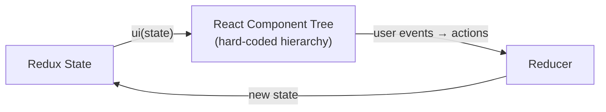
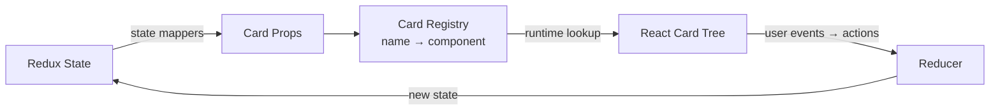
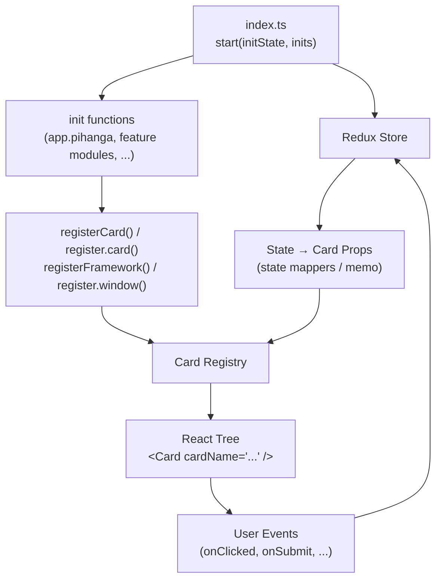

# Building a Pihanga Application

This guide walks you through the anatomy of a real Pihanga application, from the minimal counter up to a multi-page app with routing, auth, and REST data fetching.

---

## Core concept — late binding

The key idea that distinguishes Pihanga from plain React is **late binding of card slots**.

### Standard React — component hierarchy is fixed at compile time



In ordinary React a parent component hard-codes its children at compile time:

```tsx
// Standard React — parent always renders BooCard, wired at compile time
<BooCard p1={...} p2={...} />
```

### Pihanga — card slots are resolved at runtime from Redux state



In Pihanga a parent card holds a *named slot*; the actual card that fills that slot is resolved at runtime from the global registry:

```tsx
// Pihanga — parent only knows the slot name; binding happens at render time
<Card cardName={contentCard} parentCard={cardName} />
```

The value of `contentCard` is derived from Redux state, so **changing one field in the store can swap out an entire sub-tree of the UI** with no component-level code changes. This is what makes Pihanga layouts truly declarative and trivially extensible.

!!! tip "See also"
    The [home page](../index.md#core-concept-late-binding) has a concrete worked example of
    state-driven card swapping (`cars` / `trucks`) that illustrates this pattern.

---

## Minimal example — a counter

The smallest complete Pihanga app is a counter. It contains only three files and illustrates every fundamental concept.

### `src/app.state.ts`

```ts
import type { ReduxState } from "@pihanga2/core"

export type AppState = ReduxState & {
  count: number
}
```

`AppState` extends the framework's `ReduxState` (which carries the routing slice and other built-ins) and adds only a single domain field.

### `src/main.ts`

```ts
import { start, DEFAULT_REDUX_STATE } from "@pihanga2/core"
import { appPiInit } from "./app.pihanga"
import type { AppState } from "./app.state"

const initState: AppState = {
  ...DEFAULT_REDUX_STATE,  // required — seeds routing and framework slices
  count: 0,
}

start(initState, [appPiInit])
```

`start()` creates the Redux store, runs each init function, and mounts the React tree. `DEFAULT_REDUX_STATE` must always be spread in.

### `src/app.pihanga.ts`

```ts
import { registerFramework, registerCard } from "@pihanga2/core"
import { Framework }  from "./cards/frame.card"
import { Stack }      from "./cards/stack.card"
import { Button }     from "./cards/button.card"
import { Typography } from "./cards/typography.card"
import type { AppState } from "./app.state"

export function appPiInit(): void {
  // The framework card wraps the whole page — only one is ever registered
  registerFramework(Framework({ page: "page", theme: "light" }))

  registerCard(
    "page",
    Stack<AppState>({
      content: [
        Button<AppState>({
          label: "+",
          // Event handler runs as a Redux reducer — Immer mutation, no return needed
          onClicked: (state) => { state.count += 1 },
        }),
        Typography<AppState>({
          // State mapper — re-evaluated whenever Redux state changes
          text: (s) => `Count: ${s.count}`,
        }),
        Button<AppState>({
          label: "-",
          onClicked: (state) => { state.count -= 1 },
        }),
      ],
    }),
  )
}
```

Notice that `Button` and `Typography` are passed **inline** as elements of `content`. A `PiCardRef` can be either a named string (looked up in the registry at render time) or an inline card definition object — both are valid anywhere a slot is expected.

### `src/cards/button.card.tsx` — writing a custom card

```tsx
import {
  type PiCardProps,
  actionTypesToEvents,
  createCardDeclaration,
  registerActions,
  registerCardComponent,
} from "@pihanga2/core"

const CARD_TYPE = "button"

type ButtonProps  = { label: string }
type ButtonEvents = { onClicked: { id?: string } }

// Factory function — Button({ label: "+", onClicked: ... })
export const Button = createCardDeclaration<ButtonProps, ButtonEvents>(CARD_TYPE)

// Redux action types that correspond to this card's events
const BUTTON_ACTIONS = registerActions(CARD_TYPE, ["clicked"])

const Component = ({ label, onClicked, cardName }: PiCardProps<ButtonProps, ButtonEvents>) => (
  <button data-pihanga={cardName} onClick={() => onClicked({})}>
    {label}
  </button>
)

// Called at module load time — safe because registrations are buffered until start() runs
registerCardComponent({
  name: CARD_TYPE,
  component: Component,
  events: actionTypesToEvents(BUTTON_ACTIONS),
})
```

---

## Full application structure

Larger apps add routing, auth, and feature modules, but the structure is just an expansion of the minimal pattern:

```
src/
├── index.ts / main.ts     → start(initState, inits)
├── app.types.ts           → AppState = ReduxState & ...your slices
├── app.pihanga.ts         → top-level layout wired to Redux state
├── app.reducer.ts         → cross-cutting reducers (auth, default routing)
├── login.pihanga.ts       → feature module: login page
├── collections.pihanga.ts → feature module: collection list
└── cards/                 → custom card components (if needed)
    └── myCard/
        ├── index.ts
        ├── myCard.types.ts
        └── myCard.component.tsx
```

The data and control flow looks like this:



---

## Entry point — `index.ts`

For apps that use multiple card libraries and feature modules, `start()` receives an ordered array of init functions. Each init function can either receive a `PiRegister` handle or use the standalone top-level registration functions.

```ts title="src/index.ts"
import { start, DEFAULT_REDUX_STATE } from "@pihanga2/core"
import { init as pihangaInit }  from "./app.pihanga"
import { reducerInit }          from "./app.reducer"
import { init as cardLibInit }  from "@pihanga2/shadcn"   // pre-built card library
import { AppState } from "./app.types"

const initState: AppState = {
  activePage: "app/home",
  ...DEFAULT_REDUX_STATE,
}

start(initState, [
  cardLibInit,    // 1. register components from external libraries first
  pihangaInit,    // 2. then register card instances for this app
  reducerInit,    // 3. cross-cutting reducers last
])
```

**Rules:**

- `DEFAULT_REDUX_STATE` must be spread in — it seeds the routing slice and other framework defaults.
- Register card *components* before registering card *instances* that use those types.
- `start()` must be called exactly once.

---

## Application state — `app.types.ts`

The Redux store is typed through a single `AppState` that composes `ReduxState` with feature slices:

```ts title="src/app.types.ts"
import type { PiCardRef, ReduxState } from "@pihanga2/core"

export type AppState = ReduxState
  & { activePage: PiCardRef }          // which page card is showing
  & { user?: { name: string } }        // auth slice
  & { collections?: Collection[] }     // domain data

// Named card IDs — avoids magic strings
export enum AppCard {
  Login = "app/login",
  Main  = "app/main",
}
```

!!! tip "`PiCardRef` for `activePage`"
    `PiCardRef` is either a card-name string or an inline card definition object. Storing the active page as a `PiCardRef` in state lets any reducer switch pages by updating a single field, and card props can read it directly as a slot value.

---

## Top-level layout — `app.pihanga.ts`

This is where the *structure* of your UI is declared as a function of state. Two registration styles are equivalent — choose whichever suits the file:

| Style | Functions |
|---|---|
| **Standalone** (no `PiRegister` arg) | `registerFramework()`, `registerCard()`, `registerCardComponent()` |
| **PiRegister** (init receives a handle) | `register.window()`, `register.card()`, `register.cardComponent()` |

```ts title="src/app.pihanga.ts"
import { memo, type PiRegister } from "@pihanga2/core"
import { AppCard, AppState } from "./app.types"
import registerLoginPage from "./login.pihanga"
import { registerCollectionList } from "./collections.pihanga"

export function init(register: PiRegister): void {
  // Delegate feature pages to their own modules
  registerLoginPage(register)
  registerCollectionList(register)

  // Top-level window: show login when unauthenticated, main shell otherwise
  register.window<AppState>({
    page: (s) => (s.user ? AppCard.Main : AppCard.Login),
  })

  // Main shell card
  register.card(
    AppCard.Main,
    NavBarLayout<AppState>({
      title: "My Application",                  // static prop

      username: (s) => s.user?.name,            // state mapper

      navItems: memo(                            // memoized derived value
        (s) => s.user,
        (user) => buildNavItems(user),
      ),

      content: (s) => s.activePage,             // nested card by name

      // Inline event handler — runs as a Redux reducer
      onLogout: (state, _event, dispatch) => {
        delete state.user
        return state
      },
    }),
  )
}
```

### State mappers vs `memo()`

| Pattern | When to use |
|---|---|
| Static value `title: "My App"` | Prop never changes |
| State mapper `(s) => s.foo` | Simple, cheap read from state |
| `memo(selector, transform)` | Derived object/array — transform runs only when the selected slice changes |

### Inline event handlers

Event handlers are attached directly to the card definition. They run inside the Redux reducer (via Immer), so both mutation and returning a new state are valid:

```ts
onClicked: (state, _event, dispatch) => {
  state.count += 1       // Immer mutation — return is optional
},

// or with dispatch:
onLogout: (state, _event, dispatch) => {
  delete state.user
  dispatch({ type: "CLEAR_CACHE" })
  return state
},
```

---

## Feature modules — `collections.pihanga.ts`

Large applications split their cards into feature-level files. Each exports a registration function that accepts `PiRegister`:

```ts title="src/collections.pihanga.ts"
import { memo, onShowPage, showPage, type PiRegister } from "@pihanga2/core"
import { Stack, List } from "@pihanga2/shadcn"
import { AppState } from "./app.types"

export enum CollectionCard {
  Page = "app/collections/page",
  List = "app/collections/list",
}

export function registerCollectionList(register: PiRegister): void {
  register.card(
    CollectionCard.Page,
    Stack<AppState>({
      content: [CollectionCard.List],  // child referenced by name
      spacing: 2,
    }),
  )

  register.card(
    CollectionCard.List,
    List<AppState>({
      items: memo(
        (s) => s.collections,
        (cols) => (cols ?? []).map(({ id, name }) => ({ id, title: name })),
      ),
      onItemClicked: (s, { itemID }, d) => showPage(d, ["collections", itemID]),
    }),
  )

  // Switch the active page when the route matches /collections
  onShowPage<AppState>(register, (state, _action, dispatch) => {
    if (state.route.path[0] === "collections" && state.route.path.length === 1) {
      state.activePage = CollectionCard.Page
    }
  })
}
```

---

## Cross-cutting reducers — `app.reducer.ts`

Auth state, default routing, and other app-wide concerns go in a dedicated reducer file:

```ts title="src/app.reducer.ts"
import { PiRegister, onShowPage, showPage } from "@pihanga2/core"
import { AppState } from "./app.types"

export function reducerInit(register: PiRegister): void {
  // Default route: redirect "/" to "/collections"
  onShowPage<AppState>(register, (state, _action, dispatch) => {
    if (state.route.path.length === 0) {
      showPage(dispatch, ["collections"])
    }
  })
}
```

---

## Custom card components

!!! tip "Check pihanga-shadcn first"
    Before writing a card from scratch, check the **[pihanga-shadcn catalogue](https://ivcap-works.github.io/pihanga-shadcn/)** for an existing card that fits your needs. The catalogue also contains comprehensive, production-quality examples of well-structured card definitions that are worth studying even if you end up writing your own.

When the pre-built card library doesn't have what you need, create your own card in three files:

```ts title="src/cards/statusBadge/statusBadge.types.ts"
import { createCardDeclaration, actionTypesToEvents } from "@pihanga2/core"

export const STATUS_BADGE = "app/statusBadge"

export type StatusBadgeProps  = { label: string; status: "ok" | "warn" | "error" }
export type StatusBadgeEvents = { onDismiss: Record<string, never> }

export const StatusBadge         = createCardDeclaration<StatusBadgeProps, StatusBadgeEvents>(STATUS_BADGE)
export const STATUS_BADGE_ACTIONS = actionTypesToEvents<StatusBadgeEvents>(STATUS_BADGE)
```

```tsx title="src/cards/statusBadge/statusBadge.component.tsx"
import { PiCardProps } from "@pihanga2/core"

const colours = { ok: "green", warn: "orange", error: "red" } as const

export function StatusBadgeComponent({
  label, status, onDismiss,
}: PiCardProps<StatusBadgeProps, StatusBadgeEvents>) {
  return (
    <span style={{ color: colours[status] }}>
      {label}
      <button onClick={() => onDismiss({})}>×</button>
    </span>
  )
}
```

```ts title="src/cards/statusBadge/index.ts"
import { registerCardComponent } from "@pihanga2/core"
import { STATUS_BADGE, STATUS_BADGE_ACTIONS } from "./statusBadge.types"
import { StatusBadgeComponent } from "./statusBadge.component"

export { StatusBadge } from "./statusBadge.types"

export function init(register: import("@pihanga2/core").PiRegister) {
  register.cardComponent({
    name: STATUS_BADGE,
    component: StatusBadgeComponent,
    events: STATUS_BADGE_ACTIONS,
  })
}
```

Use it in any `.pihanga.ts` file:

```ts
import { StatusBadge } from "./cards/statusBadge"

register.card(
  "app/header/status",
  StatusBadge<AppState>({
    label: (s) => s.serviceStatus.message,
    status: (s) => s.serviceStatus.level,
    onDismiss: (state) => {
      delete state.serviceStatus
      return state
    },
  }),
)
```

---

## Pre-built card libraries

Rather than building every card from scratch, use the published card libraries:

| Library | Description |
|---|---|
| [`@pihanga2/shadcn`](https://ivcap-works.github.io/pihanga-shadcn/) | General-purpose cards: `Button`, `Stack`, `List`, `Table`, `Form`, `Input`, `Typography`, `ImageViewer`, `FileDrop`, … |
| `@pihanga2/joy-ui` | MUI Joy-based layout cards: `JyPage3` (nav-bar shell), `JyLogin`, … |

Browse the full card catalogue and their prop interfaces at **[https://ivcap-works.github.io/pihanga-shadcn/](https://ivcap-works.github.io/pihanga-shadcn/)**.

---

## Summary

| File | Responsibility |
|---|---|
| `main.ts` / `index.ts` | Call `start()` with initial state and ordered init functions |
| `app.state.ts` / `app.types.ts` | Compose `AppState` from `ReduxState` + feature slices |
| `app.pihanga.ts` | Top-level `registerFramework()` / `register.window()`; main shell card |
| `*.pihanga.ts` | Feature-level card registrations + `onShowPage` routing |
| `app.reducer.ts` | Cross-cutting reducers: auth, default routing |
| `cards/*/index.ts` | Custom card components via `registerCardComponent()` |

The guiding principle is **declarative layout**: each `registerCard()` call is a *description* of what a card looks like as a function of state. Pihanga subscribes to the Redux store, re-evaluates state mappers on every change, and re-renders only the affected cards — with no manual wiring.
