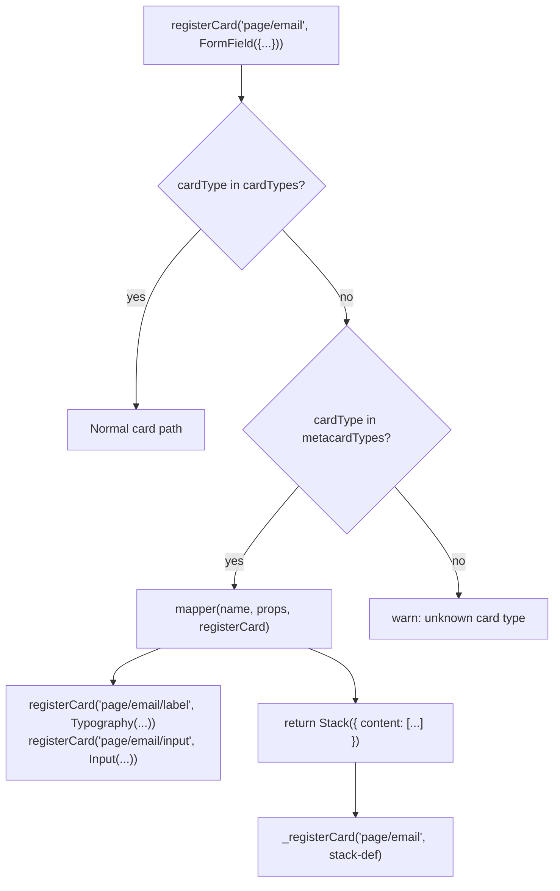

# Metacards

A **metacard** is a reusable card *type* that expands into a sub-tree of real cards at registration time.  App code uses it exactly like a normal card — the expansion is invisible to the caller.

!!! tip "When to use a metacard"
    Use a metacard when you have a recurring layout pattern (e.g. "label + input", "icon + title + body") that you want to declare as a single unit with its own typed props, but whose internals are composed from existing card types.

---

## Metacard vs normal card

| | Normal card | Metacard |
|---|---|---|
| **Registers** | 1 card instance (name → component) | A *type* that expands into N cards |
| **Who writes it** | App code, per layout | Card-library authors, once |
| **Key function** | `registerCardComponent` | `registerMetaCard` |
| **Key method** | `register.cardComponent` | `register.metaCard` |
| **Expansion** | None — direct lookup | `mapper(name, props, registerCard) → PiCardDef` |

The internal lookup flow:



---

## Defining a metacard

### Step 1 — Declare the surface type

Use `createCardDeclaration` exactly as for a normal card:

```ts title="src/cards/form-field/form-field.metacard.ts"
import {createCardDeclaration, registerMetaCard} from "@pihanga2/core";
import type {PiCardDef, PiRegisterMetaCard, RegisterCardF} from "@pihanga2/core";
import {Input, Stack, Typography} from "@pihanga2/shadcn";

type FormFieldProps = {
  label: string;
  placeholder?: string;
  value: string;
};
type FormFieldEvents = {
  onChange: {value: string};
};

export const FormField =
  createCardDeclaration<FormFieldProps, FormFieldEvents>("form/field");
```

### Step 2 — Write the mapper

The mapper receives `(name, props, registerCard)` and must:

- register all sub-cards via the provided `registerCard`
- return the **top-level** `PiCardDef`

```ts
// Narrow `props` from the erased `any` of MetaCardMapperF.
// See "Why any?" below.
type FormFieldMapperProps = PiCardDef &
  FormFieldProps & {onChange?: (ev: {value: string}) => void};

function formFieldMapper(
  name: string,
  props: FormFieldMapperProps,
  registerCard: RegisterCardF,
): PiCardDef {
  registerCard(`${name}/label`, Typography({text: props.label}));

  registerCard(
    `${name}/input`,
    Input({
      placeholder: props.placeholder ?? "",
      value: props.value,
      onChange: props.onChange,
    }),
  );

  // The returned PiCardDef becomes the card registered under `name`
  return Stack({direction: "vertical", content: [`${name}/label`, `${name}/input`]});
}
```

!!! info "Use card declaration helpers, not raw `{cardType: '...'}` objects"
    `Typography({...})` is simply `createCardDeclaration("shadcn/typography")({...})`.
    It returns the same `PiCardDef` but with TypeScript prop-checking and no hardcoded string.

### Step 3 — Register at module-load time

```ts
registerMetaCard({
  type: "form/field",                    // must match cardType in createCardDeclaration
  mapper: formFieldMapper,
  events: {onChange: "form/field/change"}, // event name → Redux action type
} satisfies PiRegisterMetaCard);
```

`registerMetaCard` uses the same buffered `register()` mechanism as `registerCardComponent` — the call is queued and replayed once `start()` has wired up `PiRegister`.  **Importing the file is enough; no explicit `init` function is needed.**

---

## Using a metacard

From the app's perspective there is no difference from using a normal card:

```ts title="src/app.pihanga.ts"
import {registerCard} from "@pihanga2/core";
import type {AppState} from "./app.state";
// Importing the metacard file registers the "form/field" type automatically
import {FormField} from "./cards/form-field/form-field.metacard";

registerCard(
  "page/email-field",
  FormField<AppState>({
    label: "Email",
    placeholder: "you@example.com",
    value: (s) => s.form.email,
    onChange: (state, {value}) => {
      state.form.email = value;
    },
  }),
);
```

When the buffer is flushed, `_registerCard` finds `"form/field"` in `metacardTypes` and calls the mapper, which registers:

- `"page/email-field/label"` → `shadcn/typography`
- `"page/email-field/input"` → `shadcn/input`
- `"page/email-field"` → `shadcn/stack` (the top card)

---

## Why does `MetaCardMapperF` use `props: any`?

`metacardTypes` is `{[k: string]: MetaCard}` where every entry has a *different* props shape.  There is no way to preserve the generic `<P>` in a plain dictionary, so the type is erased to `any` in `MetaCardMapperF`.

**You can always narrow it in your concrete mapper function.**  TypeScript's `any` suppresses both covariant and contravariant checks, so assigning `(props: MySpecificProps) => PiCardDef` to `MetaCardMapperF` is valid:

```ts
type MyMapperProps = PiCardDef & MyCardProps & {onFoo?: (ev: FooEvent) => void};

function myMapper(name: string, props: MyMapperProps, registerCard: RegisterCardF) { ... }
```

Note that each prop *may* be a **state mapper** `(s: S) => T` rather than a plain value (because `PiMapProps` permits both).  Sub-cards handle this correctly at render time, so just forward props as-is.

---

## Common pitfalls

!!! warning "Metacard type not found"
    `"unknown card type: form/field"` means `registerMetaCard` has not been called yet.
    Ensure the metacard file is imported before `start()` runs.

!!! warning "Sub-card name collisions"
    Always prefix sub-card names with `${name}/` (e.g. `${name}/label`) to guarantee uniqueness across multiple instances of the same metacard.
