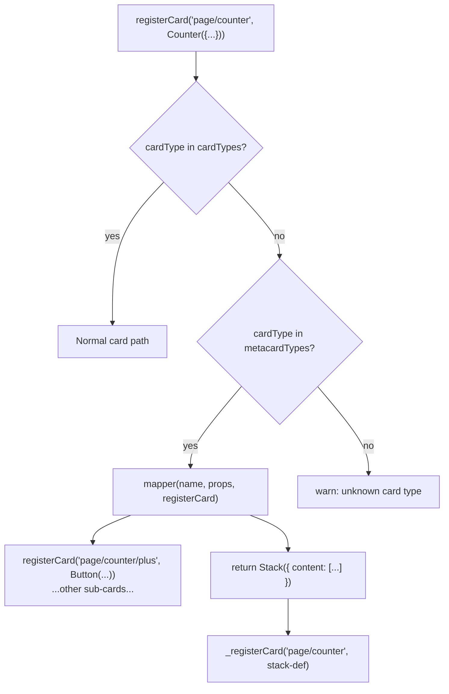

# Metacards

A **metacard** is a reusable card *type* that expands into a sub-tree of real cards at registration time.  App code uses it exactly like a normal card — the expansion is invisible to the caller.

!!! tip "When to use a metacard"
    Use a metacard when you have a recurring UI pattern (e.g. "decrement / value / increment", "label + input") that you want to declare as a single unit with its own typed props and events, but whose internals are composed from existing card types.

---

## Metacard vs normal card

| | Normal card | Metacard |
|---|---|---|
| **Registers** | 1 card instance (name → component) | A *type* that expands into N cards |
| **Who writes it** | App code, per layout | Card-library authors, once |
| **Key function** | `registerCardComponent` | `registerMetaCard` |
| **Key method** | `register.cardComponent` | `register.metaCard` |
| **Expansion** | None — direct lookup | `mapper(name, props, registerCard) → PiCardDef` |

The internal lookup flow:



---

## Worked example — Counter metacard

The `Counter` metacard assembles three `@pihanga2/shadcn` cards into a decrement/value/increment widget.  It is the reference implementation from `pihanga-shadcn/example`.

### Step 1 — Declare the surface type

```ts title="src/cards/counter/counter.card.ts"
import {
  createCardDeclaration,
  createOnAction,
  registerActions,
  registerMetaCard,
} from "@pihanga2/core";
import type {
  PiCardDef,
  PiMapProps,
  PiRegisterMetaCard,
  ReduxState,
  RegisterCardF,
} from "@pihanga2/core";
import {Stack, Button, Typography} from "@pihanga2/shadcn";

const COUNTER_CARD = "meta/counter";

/** Card declaration — drop a Counter anywhere in a layout: */
export const Counter = createCardDeclaration<CounterProps, CounterEvents>(
  COUNTER_CARD,
);

/** Namespaced action constants for the Counter meta card. */
export const COUNTER_ACTION = registerActions(COUNTER_CARD, ["changed"]);

/**
 * Convenience helper for reducers that respond to a counter change.
 *
 * @example
 * ```ts
 * onCounterChanged(register, (state, { value }) => { state.count = value });
 * ```
 */
export const onCounterChanged = createOnAction<CounterChangeEvent>(
  COUNTER_ACTION.CHANGED,
);

type CounterProps  = { value: number };
type CounterEvents = { onChange: CounterChangeEvent };
export type CounterChangeEvent = { value: number };
```

### Step 2 — Write the mapper

The mapper receives `(name, props, registerCard)` and must:

- register all named sub-cards via the provided `registerCard` callback
- return the **top-level** `PiCardDef`

```ts
function CounterMapper(
  _: string,
  props: PiMapProps<CounterProps & CounterEvents>,
  registerCard: RegisterCardF,
): PiCardDef {
  // Register the increment button under a stable name so it has a persistent
  // identity in the card registry.  registerCard returns the card name (or
  // inline PiCardDef) which can be placed directly in a content array.
  const plusButton = registerCard(
    "plus",
    Button({
      label: "+",
      opts: {size: "lg"},
      // Re-map the raw click event into the domain action COUNTER_ACTION.CHANGED
      onClickedMapper: (_, {resolve}) => ({
        type: COUNTER_ACTION.CHANGED,
        value: resolve(props.value) + 1,   // (1)
      }),
    }),
  );

  return Stack<AppState>({
    direction: "row",
    alignItems: "center",
    spacing: 4,
    content: [
      Button<AppState>({
        label: "−",
        opts: {size: "lg"},
        onClickedMapper: (_, {resolve}) => ({
          type: COUNTER_ACTION.CHANGED,
          value: resolve(props.value) - 1,
        }),
      }),

      // text is a state mapper so it re-evaluates on every Redux state change
      Typography<AppState>({
        text: (_, {resolve}) => `Count: ${resolve(props.value)}`,  // (2)
        level: "h2",
        className: "min-w-[120px] text-center",
      }),

      plusButton,
    ],
  });
}
```

### Step 3 — Register at module-load time

```ts
registerMetaCard({
  type: COUNTER_CARD,
  mapper: CounterMapper,
  events: COUNTER_ACTION,   // maps event name → Redux action type
} satisfies PiRegisterMetaCard);
```

`registerMetaCard` uses the same buffered mechanism as `registerCardComponent` — the call is queued and replayed once `start()` has wired up `PiRegister`.  **Importing the file is enough; no explicit `init` function is needed.**

---

## Using the metacard

```ts title="src/app.pihanga.ts"
import {registerCard} from "@pihanga2/core";
import type {AppState} from "./app.state";
// Importing registers the "meta/counter" type automatically
import {Counter, onCounterChanged} from "./cards/counter/counter.card";

registerCard(
  "page/counter",
  Counter<AppState>({
    value: (s) => s.count,                      // state mapper
    onChange: (state, {value}) => {
      state.count = value;
    },
  }),
);
```

When flushed, `_registerCard` finds `"meta/counter"` in `metacardTypes` and calls `CounterMapper`, which registers:

- `"page/counter/plus"` → `shadcn/button`
- `"page/counter"` → `shadcn/stack` (the top card, containing inline sub-cards)

---

## `resolve` — reading props that may be state mappers { #resolve }

Props passed to a metacard may be **plain values** *or* **state mappers** `(s: S, ctx) => T` (because `PiMapProps` permits both).  The mapper function itself runs at *registration time*, before any state exists, so calling `props.value` may hand you a function rather than a number.

The `registerCard` callback provides a `resolve` function in the context argument of every event mapper and state mapper:

```ts
// (1) Inside an onXxxMapper (event re-mapping):
onClickedMapper: (_, {resolve}) => ({
  type: COUNTER_ACTION.CHANGED,
  value: resolve(props.value) + 1,  // resolve evaluates the state mapper NOW
                                     // using the current Redux state
}),

// (2) Inside a state mapper of a sub-card:
text: (_, {resolve}) => `Count: ${resolve(props.value)}`,
//        ↑ ctx.resolve  ─ resolves at render time with the current state
```

`resolve(prop)` behaves as follows:

| `prop` is … | `resolve` returns … |
|---|---|
| A plain value (string, number, …) | the value unchanged |
| A state mapper `(s, ctx) => T` | `mapper(currentState, ctx)` |

For sub-cards of a metacard, `resolve` automatically uses **`metaCtxtProps`** (the `ctxtProps` from where the metacard itself was placed) as the `ctxtProps` when calling the mapper — so state mappers that reference `ctxtProps.someField` will correctly see the metacard's placement context rather than the sub-card's own context.

---

## Event re-mapping with `onXxxMapper` { #event-remapping }

Metacards can intercept and transform low-level events from inner cards into domain-specific actions using `onXxxMapper`:

```
Button.onClicked  ──► onClickedMapper ──► COUNTER_ACTION.CHANGED
                                           { value: newCount }
```

The mapper receives `(event, ctxtProps)` where `ctxtProps.resolve` is available:

```ts
onClickedMapper: (clickEvent, {resolve}) => ({
  type: COUNTER_ACTION.CHANGED,
  value: resolve(props.value) + 1,
}),
```

Consumers of `Counter` never need to know about raw click events; they simply handle `onCounterChanged` and receive the updated value.

---

## `metaCtxtProps` — accessing the metacard's placement context { #metactxtprops }

When a metacard is placed by a parent card that passes extra `ctxtProps` (e.g. from a table row), sub-cards of the metacard need access to those props too.  They are available as `metaCtxtProps` in the `StateMapperContext`:

```ts
// Parent places the metacard with extra context:
// <Card cardName="page/element" elementData={...} parentCard="page/table" />

// Inside the metacard definition, sub-card state mappers can use metaCtxtProps:
registerCard(
  "inner",
  MyInnerCard<AppState>({
    // metaCtxtProps = ctxtProps of the metacard's top card
    properties: (s, {metaCtxtProps}) => metaCtxtProps.elementData.properties,
  }),
);
```

`metaCtxtProps` is `undefined` for top-level cards and cards that are not sub-cards of a metacard.

The same context is available via `resolve` inside an event mapper:

```ts
onClickedMapper: (_, {resolve}) => {
  // props.properties might be the state mapper above
  const props = resolve(myProps.properties);
  return {type: "MY_ACTION", props};
},
```

---

## Why does `MetaCardMapperF` use `props: any`?

`metacardTypes` is `{[k: string]: MetaCard}` where every entry has a *different* props shape.  There is no way to preserve the generic `<P>` in a plain dictionary, so the type is erased to `any` in `MetaCardMapperF`.

**You can always narrow it in your concrete mapper function.**  TypeScript's `any` suppresses both covariant and contravariant checks, so assigning `(props: MySpecificProps) => PiCardDef` to `MetaCardMapperF` is valid:

```ts
type MyMapperProps = PiCardDef & MyCardProps & {onFoo?: (ev: FooEvent) => void};

function myMapper(name: string, props: MyMapperProps, registerCard: RegisterCardF) { ... }
```

Note that each prop *may* be a **state mapper** `(s: S, ctx) => T` rather than a plain value (because `PiMapProps` permits both).  Always use `resolve(props.xxx)` inside event mappers and sub-card state mappers to handle both cases correctly.

For a fully typed alternative that enforces this split at compile time, see the [Typed static / dynamic props](#typed-props) section below.

---

## Typed static / dynamic props { #typed-props }

By default, `createCardDeclaration` allows every prop to be either a plain value **or** a `memo(...)` state-selector — the consumer decides at the call-site.  Sometimes a card author wants to **enforce** that certain props can never be a selector (they must be known at registration time, e.g. a layout mode, a link list, a display label).

Three complementary tools provide this guarantee end-to-end:

| Tool | Used by | Enforces |
|---|---|---|
| `createCardDeclaration2` | card-library author | consumers must pass **plain values** for `StaticProps`; selectors are only accepted for `DynProps` |
| `PiMetaProps` | mapper author | mapper sees plain `T` for static props and `StateMapper<T>` for dynamic props |
| `PiMetaResolveCtx` | mapper author | `ctx.resolve` only accepts a `StateMapper` (passing a plain value is a TS error) |

### `createCardDeclaration2` — enforcing static props for consumers

`createCardDeclaration2<DynProps, StaticProps, Events>` produces a declaration factory where the type split is enforced at every call-site:

- **`DynProps`** → each key accepts `T` **or** `StateMapper<T>` (a `memo(...)` selector)
- **`StaticProps`** → each key accepts **only** a plain value; passing a selector is a TypeScript error

```ts title="counter.card.ts (typed declaration)"
import {createCardDeclaration2} from "@pihanga2/core";

// value must come from Redux state; label must be a fixed string
type CounterDynProps    = { value: number };
type CounterStaticProps = { label: string };
type CounterEvents      = { onChange: CounterChangeEvent };

export const Counter = createCardDeclaration2<
  CounterDynProps,
  CounterStaticProps,
  CounterEvents
>(COUNTER_CARD);

// ✅ OK — value is a selector, label is a plain string
Counter<AppState>({
  value: (s) => s.count,
  label: "Score",
  onChange: (state, {value}) => { state.count = value },
});

// ❌ TypeScript error — label must be a plain string, not a selector
Counter<AppState>({
  value: (s) => s.count,
  label: (s) => s.title,   // ← compile error
  onChange: ...,
});
```

The app author sees the same single `Counter(...)` call — the enforcement is invisible to the call-site shape.

### `PiMetaProps` — typing the mapper function

The matching type for the *mapper* side is `PiMetaProps<DynProps, StaticProps, Events>`.  It mirrors the declaration split:

- `StaticProps` → the mapper receives plain `T` (calling it as a function would be a TS error)
- `DynProps` → the mapper receives `StateMapper<T>` (it is always a selector — always use `resolve()`)

```ts title="counter.card.ts (typed mapper)"
import type {
  PiCardDef,
  PiMetaProps,
  PiMetaResolveCtx,
  RegisterCardF,
} from "@pihanga2/core";

function CounterMapper(
  _: string,
  props: PiMetaProps<CounterDynProps, CounterStaticProps, CounterEvents>,
  registerCard: RegisterCardF,
): PiCardDef {
  // props.label is guaranteed to be a plain string — no resolve() required
  const labelText = props.label;

  // props.value is guaranteed to be a StateMapper — always use resolve()
  return Stack({
    content: [
      Button({
        label: "−",
        onClickedMapper: (_, {resolve}: PiMetaResolveCtx) => ({
          type: COUNTER_ACTION.CHANGED,
          value: resolve(props.value) - 1,
        }),
      }),
      Typography({
        text: (_, {resolve}: PiMetaResolveCtx) =>
          `${labelText}: ${resolve(props.value)}`,
      }),
      Button({
        label: "+",
        onClickedMapper: (_, {resolve}: PiMetaResolveCtx) => ({
          type: COUNTER_ACTION.CHANGED,
          value: resolve(props.value) + 1,
        }),
      }),
    ],
  });
}
```

### `PiMetaResolveCtx` — narrowed resolve context

`PiMetaResolveCtx` is a structurally compatible subset of `StateMapperContext` where `resolve` accepts **only** a `StateMapper` (not `T | StateMapper<T>`).  Annotate the `ctx` parameter of any sub-card prop function with it to:

1. Communicate clearly that the prop will always be a selector (intent documentation).
2. Get a compile-time error if you accidentally pass a plain value to `resolve`.

```ts
// Standard ctx — resolve accepts T | StateMapper<T>
text: (_, ctx) => `Count: ${ctx.resolve(props.value)}`,

// PiMetaResolveCtx — resolve only accepts StateMapper<T>
text: (_, ctx: PiMetaResolveCtx) => `Count: ${ctx.resolve(props.value)}`,
//                                    ↑ TS error if props.value is a plain value
```

!!! tip "When to use the typed variants"
    Use `createCardDeclaration2` + `PiMetaProps` + `PiMetaResolveCtx` when a card has a clear split between *structure* (fixed at registration time — titles, layout modes, link lists) and *data* (driven by Redux state — counts, names, selections).  For simpler metacards where every prop may legitimately be dynamic, the plain `createCardDeclaration` + `PiMapProps` combination is sufficient.

---

## Common pitfalls

!!! warning "Metacard type not found"
    `"unknown card type: meta/counter"` means `registerMetaCard` has not been called yet.
    Ensure the metacard file is imported before `start()` runs.

!!! warning "Sub-card name collisions"
    Always prefix sub-card names with `"${name}/"` (e.g. `registerCard("plus", ...)` — the framework automatically prepends `name + "/"`) to guarantee uniqueness across multiple instances of the same metacard.

!!! warning "Calling props.value directly in the mapper"
    `props.value` may be a state mapper function rather than a plain number.  Always use `resolve(props.value)` inside event mappers and sub-card state mappers — never call the prop directly.

!!! warning "metaCtxtProps undefined for non-sub-cards"
    `metaCtxtProps` is only set for cards registered *inside* a metacard mapper (sub-cards). The metacard's own top card uses `ctxtProps` as usual.
