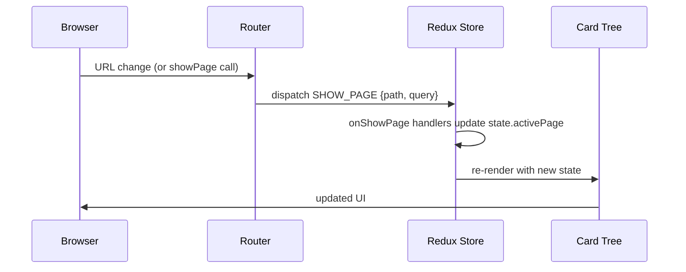

# Routing Guide

Pihanga uses the [`history`](https://github.com/remix-run/history) library for browser-based
routing. Routes are stored in `state.route` as a Redux state slice and updated via dispatched actions.

---

## Navigate to a page — `showPage`

`showPage` dispatches a navigation action. It takes a **dispatch function** and a **path array**:

```ts
import { showPage } from "@pihanga2/core";

// Inside a card event handler or inline reducer:
onItemClicked: (state, { itemID }, dispatch) => {
  showPage(dispatch, ["items", itemID]);
  return state;
},
```

An optional third argument is a query-parameter map:

```ts
showPage(dispatch, ["dashboard"], { tab: "overview" });
// navigates to: /dashboard?tab=overview
```

!!! note "Path as an array"
    The path is always a `string[]` of URL segments — `"/items/42"` is represented as
    `["items", "42"]`. This makes pattern matching in handlers simpler and avoids manual
    string parsing.

---

## React to a route change — `onShowPage`

`onShowPage` registers a reducer that fires whenever a `SHOW_PAGE` action is dispatched
(i.e. on every programmatic or browser navigation). It receives the full Redux state and the
route action, and must return the (possibly mutated) state.

```ts
import { onShowPage, type PiRegister } from "@pihanga2/core";
import type { AppState } from "./app.types";

export function init(register: PiRegister): void {
  onShowPage<AppState>(register, (state, action, dispatch) => {
    // action.path  — string[] of URL segments
    // action.query — parsed query parameters
    switch (state.route.path[0]) {
      case "items":
        state.activePage = "page/items";
        break;
      case "settings":
        state.activePage = "page/settings";
        break;
      default:
        // redirect bare root to items
        if (state.route.path.length === 0) {
          showPage(dispatch, ["items"]);
        }
    }
    return state;
  });
}
```

You can register multiple `onShowPage` handlers — they all run in registration order.

---

## Initialisation hook — `onInit`

`onInit` fires exactly once when the application first starts (before the first navigation):

```ts
import { onInit, type PiRegister } from "@pihanga2/core";
import type { AppState } from "./app.types";

export function init(register: PiRegister): void {
  onInit<AppState>(register, (state, _action, dispatch) => {
    dispatch({ type: "APP_INIT" });
    return state;
  });
}
```

---

## Every navigation — `onNavigateToPage`

`onNavigateToPage` fires on **every** navigation event (any path), including browser back/forward.
It receives a `{ url: string; fromBrowser: boolean }` action:

```ts
import { onNavigateToPage, type PiRegister } from "@pihanga2/core";
import type { AppState } from "./app.types";

export function init(register: PiRegister): void {
  onNavigateToPage<AppState>(register, (state, action, _dispatch) => {
    console.log("Navigated to:", action.url, "fromBrowser:", action.fromBrowser);
    return state;
  });
}
```

---

## The `Route` object

The current route is stored at **`state.route`** (not `state.pihanga.route`):

```ts
type Route = {
  path: string[];                                   // URL segments: "/items/42" → ["items", "42"]
  query: Record<string, string | boolean | number>; // parsed query params
  url: string;                                      // full path + query string
  fromBrowser?: boolean;                            // true when triggered by browser back/forward
};
```

You can read it from any state mapper or reducer:

```ts
register.card("page/nav", NavBar<AppState>({
  currentSection: (s) => s.route.path[0] ?? "home",
}));
```

---

## Typical routing pattern

The most common pattern stores the active page card name in state and updates it in
`onShowPage`. The framework/window card then reads it as its `page` prop:



```ts title="src/app.types.ts"
export type AppState = ReduxState & {
  activePage: PiCardRef;
}
```

```ts title="src/app.pihanga.ts"
// Window card — driven by state.activePage
register.window<AppState>({
  page: (s) => s.activePage,
});
```

```ts title="src/app.reducer.ts"
// Route handler — maps URL segments to card names
onShowPage<AppState>(register, (state, _action, dispatch) => {
  switch (state.route.path[0]) {
    case "collections": state.activePage = "app/collections/page"; break;
    case "settings":    state.activePage = "app/settings/page";    break;
    default:
      if (state.route.path.length === 0) {
        showPage(dispatch, ["collections"]);  // default route
      }
  }
  return state;
});
```
