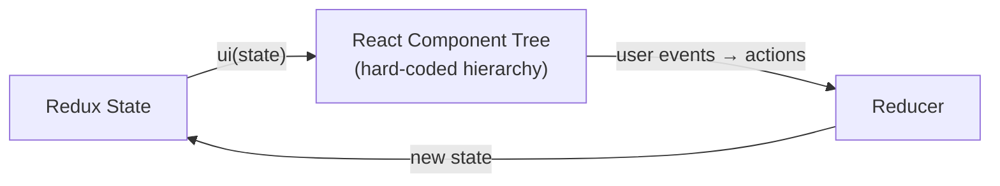
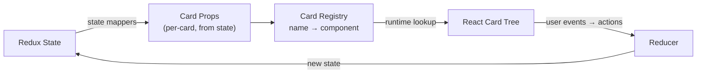
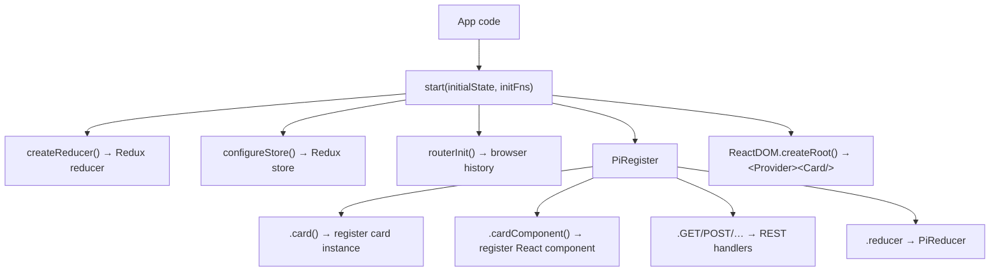

# @pihanga2/core

`@pihanga2/core` is the **runtime engine** of the [Pihanga](https://github.com/ivcap-works/pihanga)
declarative, card-based UI framework for React.

---

## Why Pihanga?

Most internal web frontends are built for relatively small user bases that interact with complex
backends. These systems start small but expand over time — different teams adding different
capabilities, all while users demand a unified UX.

We use micro-services to avoid unnecessary coupling in backends, but on the frontend teams still
end up modifying shared code to add new features. **Pihanga brings the micro-services philosophy
to the frontend.**

Consider a car-booking service: after launch, a truck-fleet team wants to add their service to
the same app. Their backend is entirely different, and the original team has moved on. With a
conventional React app the truck team would have to fork and patch the existing frontend. With
Pihanga, **they ship a self-contained module** — new cards plus an extension to the global card
registry — and plug it in without touching any existing code.

---

## Core concept — late binding

The key idea that separates Pihanga from plain React is **late binding of card slots**.

### Standard React — early binding



In a standard React + Redux app the component hierarchy is fixed at compile time. A parent
component always knows exactly which child component it renders:

```tsx
// Hard-coded: FooCard always renders BooCard
export const FooCard = (props) => (
  <>
    <BooCard p1={...} p2={...} />
  </>
);
```

### Pihanga — late binding via the card registry



In Pihanga a parent card holds a *named slot*. The actual card rendered into that slot is looked
up in the global registry at runtime — and the slot value itself comes from Redux state:

```tsx
// Late-bound: FooCard renders whatever card name 'contentCard' holds
export const FooCard = ({ contentCard }) => (
  <>
    <Card cardName={contentCard} />
  </>
);
```

Because `contentCard` is a Redux state value, **changing one field in the store can swap out an
entire sub-tree of the UI** with no component-level code changes:

```ts
// State-driven routing: changing state.showList swaps the entire content card
registerCard("page", AppPage({
  title: "Transportation Service",
  subTitle: (_, ref) => ref(".", "contentCard", "title"),  // reads the embedded card's title
  contentCard: (state) => state.showList,                  // "cars" or "trucks"
}));

registerCard("cars",   Table({ title: "Cars",   ... }));
registerCard("trucks", Table({ title: "Trucks", ... }));
```

Setting `state.showList = "trucks"` instantly swaps the content card *and* updates the subtitle —
without touching any component code.

---

## What `@pihanga2/core` provides

- **Card registration** — global registry mapping card-type IDs → React components
- **Redux store bootstrap** — creates a Redux store wired to Pihanga's reducer factory
- **Routing** — browser-based navigation with `showPage` / `onShowPage` helpers
- **REST helpers** — typed `register.GET/POST/PUT/PATCH/DELETE` that hook into Redux actions

---

## Architecture



---

## Quick Links

| | |
|---|---|
| [Installation](getting-started/installation.md) | Add `@pihanga2/core` to your project |
| [Quick Start](getting-started/quick-start.md) | Bootstrap a Pihanga app in minutes |
| [Building an Application](guides/deployment.md) | Full app anatomy with routing & feature modules |
| [Cards Guide](guides/cards.md) | Create and register card types |
| [Routing Guide](guides/routing.md) | Navigate between pages; react to route changes |
| [REST API Guide](guides/rest-api.md) | Register typed REST handlers |
| [API Reference](api/overview.md) | Full public API surface |

---

## Stack

- **TypeScript** ^5.0
- **React** ^18 (peer dependency)
- **Redux Toolkit** ^2
- **history** ^5 (routing)
- **tslog** ^4 (logging)
